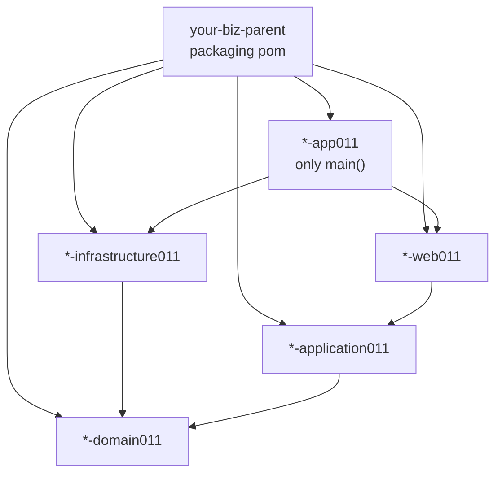

# 020 — Business Project Quickstart

> Consumer-facing shortcut handbook: how to stand up a **business** Maven project on `klsjnh-java17-framework011`.
> Lessons distilled from reference consumer `yw-java17-supplier011`. Not for framework maintainers.

**Companion prompt (copy-paste for Cursor/AI):** [[020.business-project-quickstart.prompt]]

---

## 1. Who this is for

| You are… | Use this doc |
|----------|--------------|
| Building a business system that **depends on** the framework | Yes |
| Changing core platform modules inside the framework | No — use `Agent.md` → `011` / `016` / `infrastructure011/` |

> [!note]
> One fact, one home. Stack / build commands live in [[015.project-info]]; coding gates in [[016.coding-standards]]; agreements in [[011.agreements]]. This note only covers **consumer bootstrap**.

---

## 2. Prerequisites

- **JDK 17** (LTS)
- **Maven 3.8+**
- **MySQL 5.7+** (framework also documents MySQL 8 deploy), typical local map: host port **33306** → container `3306` (e.g. `mysql013`)
- Framework installed to local `.m2`:

```bash
cd /path/to/klsjnh-java17-framework011
mvn clean install -DskipTests
```

> [!tip]
> Parent POM coordinates: `com.klsjnh:java17-framework011:1.0.0`. Point your business parent’s `<relativePath>` at the framework `pom.xml` (or rely on `.m2` after `install`).

---

## 3. Scaffold: parent POM + five modules

Mirror the framework DDD layers in **your** groupId:



| Module | Role | Typical depends on |
|--------|------|--------------------|
| `*-domain011` | Aggregates, ports, pure kernel | `java17-security-api011` (framework API), `java17-core011` |
| `*-application011` | Use cases + `@Transactional` | domain + `java17-core011` |
| `*-infrastructure011` | PO / Mapper / adapters | domain + `java17-core011` + `java17-data-mybatis011-starter` |
| `*-web011` | Controllers / VOs | application + `java17-core011` |
| `*-app011` | **Only** `main` + `application*.yml` | framework starters (`java17-security-starter011`, `java17-data-mybatis011-starter`, …) |

Framework modules are consumed as **BOM + starters**: import `java17-bom011`, then add the starters you need (`java17-core011` is pulled in transitively). See 015.project-info / infrastructure011/013 for the module map.

**Starter selection:**

| Starter | Required? | Behavior when omitted |
|---|---|---|
| `java17-security-starter011` | **required** (web apps fail to start without it — `AuthChainPresenceCheck011`) | — |
| `java17-data-mybatis011-starter` | **required** (dynamic datasource kernel + framework mapper scan) | — |
| `center-datasource011-starter` | optional (needed for julyDatasource / julySql / julySync admin HTTP) | no `/klsjnh/datasource/**` management / Sql / Sync；`SqlRoutingPort` still available via data-mybatis |
| `java17-scheduler-quartz011-starter` | optional | full julyScheduler stack absent from classpath (404; no start/stop), the rest of system011 keeps working |
| `center-access011-starter` | optional (needed for org/role/menu/perm) | no org/role/menu/perm catalog / assignRoles / AuthorizationAdapter; **user login still works**; production write whitelist gate **off** |
| `center-platform011-starter` | optional (needed for dictionary / julyConfig admin) | no `/klsjnh/system011/julyDictionary/**` or `/klsjnh/system011/julyConfig/**` management APIs |
| `center-ai011-starter` | optional | the whole `/klsjnh/aicenter/**` tree 404s — inference / tts / asr / image **and** the management plane (model provider, prompt) |
| `center-storage011-starter` | optional (required when storage is used) | `/klsjnh/storagecenter/**` 404; `backup011` returns 403 "storage capability not enabled" (soft dependency) |
| `center-message011-starter` | optional | the whole `/klsjnh/messagecenter/**` tree 404s (out- and inbound, management included) |
| `java17-observability011-starter` | optional | no actuator / metrics / traceId MDC |

**groupId pattern (supplier example):** `com.yuwang.supplier011` → artifacts `yw-supplier-domain011` …

**Parent POM essentials:**

```xml
<parent>
  <groupId>com.klsjnh</groupId>
  <artifactId>java17-framework011</artifactId>
  <version>1.0.0</version>
  <!-- Adjust to your disk layout; wrong relativePath = unresolved parent -->
  <relativePath>../../Source/java17/klsjnh-java17-framework011/pom.xml</relativePath>
</parent>

<groupId>com.yourco.biz011</groupId>
<artifactId>yw-java17-biz011</artifactId>
<packaging>pom</packaging>
```

Declare framework + own modules in `<dependencyManagement>`, list five `<module>`s.

---

## 3.5 活示例（照抄入口）

消费方演示拆成两个兄弟工程（均在框架仓库外 `/mnt/d/Source/java17/`）：

| 工程 | 定位 | Starters | DB | 端口 | 冒烟 |
|------|------|----------|----|------|------|
| **`java17-demo011-app011`** | **最小登录 + `july_demo011` CRUD**（无调度） | 仅 `security` + `data-mybatis` | 新库 **`july_demo011core`** + [`july_core011.sql`](sql/july_core011.sql) + 消费方 `sql/july_demo011.sql` | **11161** | **dev**（`debug`）：免密登录 + 用户 CRUD + `/demo011/demo/v1` CRUD；**prod**：密码登录 200、免密 401、带 token 的 `july_demo011` CRUD |
| **`java17-demo013-app013`** | **完整 CRUD + 调度**（原 demo011 改名） | 再加 `java17-scheduler-quartz011-starter` | 共用开发库 `klsjnh_framework011` + 业务表 `sql/july_demo013.sql`；调度 DDL [`july_scheduler011.sql`](sql/july_scheduler011.sql)（含 `july_scheduler_audit`） | **11163** | debug 免密登录；调度 `demo013job`：insert→start→runOnce→stop，`executeTimes` 递增；`selectExecListByPage` 可见 SUCCESS/FAIL 子行 |

构建前提：框架仓库先 `mvn -o clean install`（装入 `.m2`）。WSL 冒烟常用发行版：**`ubunut2204_011`（wsl011）** 起 jar；MySQL 管理（建库 / `--ssl-mode=DISABLED`）多在 **`dev016`**（容器 `klsjnh-framework011-mysql`，宿主 **33306**）。

最小 011 建库示例：

```bash
# root 经 docker（dev016）
sudo docker exec -i klsjnh-framework011-mysql mysql -uroot -proot123456 \
  -e "CREATE DATABASE IF NOT EXISTS july_demo011core DEFAULT CHARSET utf8mb4;
      GRANT ALL ON july_demo011core.* TO 'dev202608011'@'%'; FLUSH PRIVILEGES;"
mysql -h127.0.0.1 -P33306 -udev202608011 -pdev202608011 --ssl-mode=DISABLED july_demo011core \
  < /mnt/d/Source/java17/klsjnh-java17-framework011/docs/sql/july_core011.sql
mysql ... july_demo011core < /mnt/d/Source/java17/java17-demo011-app011/sql/july_demo011.sql
mysql ... july_demo011core < /mnt/d/Source/java17/java17-demo011-app011/sql/seed_demo011_user.sql
```

冒烟：**优先**框架仓库脚本 `tools/demo011-dual-mode-smoke.sh`（jar 已在 :11161 时 `MODE=dev` 与 `MODE=prod` 各跑一次，均 EXIT=0 才算 G9a 过）；手工 curl 见消费方 `java17-demo011-app011/README.md`。G9b 调度审计分页入参为 **`pkMt`**（列 `pk_mt`）。

## 4. Boot wiring

Application class lives in `*-app011` only:

```java
// Framework beans self-register via auto-configuration — the host NEVER
// scans com.klsjnh. Scan ONLY your own packages:
@SpringBootApplication(scanBasePackages = "com.yourco.biz011")
// Framework mapper packages are auto-scanned by the data starter
// (DataMybatisAutoConfiguration011). Declare only YOUR mapper packages:
@MapperScan("com.yourco.biz011.infrastructure")
public class Biz011Application {
    public static void main(String[] args) {
        SpringApplication.run(Biz011Application.class, args);
    }
}
```

> [!warning]
> Do NOT add `com.klsjnh` to `scanBasePackages` — the framework registers itself (double registration = bean conflicts). The framework mapper packages are likewise auto-scanned by the data starter. If you boot a web app without the security starter, `AuthChainPresenceCheck011` fails the startup (fail closed).

**URL ↔ package rule** (see [[016.coding-standards]]): first path segment after the product prefix must appear in the controller package.

| Framework controllers | `/klsjnh/<module>/...` |
| Business controllers (supplier) | `/yuwang/<module>/...` e.g. `...web.supplier.controller` → `/yuwang/supplier/...` |

---

## 5. Database bootstrap

Order matters:

1. **Create empty schema** (e.g. `CREATE DATABASE biz011 ...`).
2. **Import framework DDL** from `docs/sql/` — see [[sql/README|docs/sql/README]].
   - Run each `july_*.sql` needed (`CREATE TABLE IF NOT EXISTS`).
   - Skip `base-entity-columns.sql` (template only).
   - Skip `july_demo011.sql` unless you want the demo table.
   - Prefer CREATE scripts that already include `alive_*` generated unique columns; only run `logic-delete-unique-fix.sql` if migrating old UNIQUE columns.
3. **Import your business DDL**.
4. **Seed a login user** if needed — framework does **not** ship a default admin SQL; `july_user` empty ⇒ `loginByUserName` fails until you insert.

> [!danger]
> Empty / missing `july_*` platform tables ⇒ app often **fails to start** (`Table 'xxx' doesn't exist`). Always import framework SQL into the **same** DB as `spring.datasource.url` before first boot.

---

## 6. Config

| File | Purpose |
|------|---------|
| `application.yml` | Port, `spring.profiles.active`, storage defaults, non-secret knobs |
| `application-development.yml` | Shared **dev** JDBC + `krt.*` (commit-safe if secrets via env) |
| `application-local.yml` (optional) | Machine-only overrides; often profile group `local: development` |

**Main datasource** (business + `july_*` live here):

```yaml
spring:
  datasource:
    url: jdbc:mysql://127.0.0.1:33306/biz011?useUnicode=true&characterEncoding=utf8&serverTimezone=Asia/Shanghai&useSSL=false&allowPublicKeyRetrieval=true
    username: ${BIZ011_DB_USER:biz011}
    password: ${BIZ011_DB_PASSWORD:CHANGE_ME}
```

**External / dynamic datasources** — bootstrap via `krt.ci011`; runtime truth is table `july_datasource` (seeded on start):

```yaml
krt:
  status: debug          # debug: auth filter does not reject (dev only)
  jwt:
    secret: CHANGE_ME_DEV_JWT_SECRET_MIN_LENGTH
    expire-minutes: 480
  ci011:
    - ds-code: ext011
      ds-name: External DB
      ds-type: oracle     # mysql | oracle | sqlserver shipped with data-starter; postgresql = dialect SPI only (add your own JDBC driver)
      ds-url: jdbc:oracle:thin:@//host:1521/service
      username: ${EXT011_DB_USER:reader}
      password: ${EXT011_DB_PASSWORD:CHANGE_ME}
```

> [!tip]
> Prefer env placeholders for passwords. Never commit production secrets. Same `dsCode` must not exist in both `ci011` and `july_datasource`.
>
> **Honesty**: default framework app uses `spring.profiles.active=development` + `krt.status: debug` (auth filter does not reject). That is **dev convenience**, not a production contract. Demo Seed (`AuthPermissionDemoSeed011`) lives in `java17-app011/src/test` only — fat jar / `dev011` do not auto-reset passwords.

---

## 7. Data access rule (hard)

> [!danger]
> For remote SQL against `krt.ci011` / `july_datasource` codes, inject **`SqlRoutingPort`** (`selectList` / `selectListByPage` / `selectOne` / `execute`).
> **Do not** default to HTTP dataservice `executeSql` / lowcode `julyBusinessModeling` endpoints.

| Do | Don’t |
|----|--------|
| `SqlRoutingPort.selectList("nc011", sql)` | `POST .../executeSql` over HTTP to another app |
| Keep main DB (MyBatis-Plus / `july_*`) separate from dynamic DS | Mix dynamic JDBC into the primary DataSource blindly |

Domain may wrap a port named `DataservicePort`; infrastructure should adapt it to **`SqlRoutingPort`**, not an HTTP client.

Details: [[infrastructure011/018.datasource-center/015.topic-usage|datasource-center usage]].

---

## 8. Extension points (short)

### Message center SPI

Implement `@Component` `MessageChannelPort` (`channelCode()` = `provider_type`), scan only your own packages (the framework self-registers) + your package. Insert a row in `july_message_outbound_channel`. See [message-center usage](infrastructure011/016.message-center/015.topic-usage.md).

### Master–sub (`pk_mt`)

- Child PO implements `MasterLinked`; link column **`pk_mt`** → master `id`.
- Prefer `BaseMasterSubRepository` / master-sub APIs (`saveChildren` / `saveWhole`, etc.).
- Surviving uniqueness via generated **`alive_*`** columns (logic-delete friendly).

See [[infrastructure011/011.persistence-spec/018.topic-master-sub-api|master-sub API]] and [[016.coding-standards]].

### Coding / process pointers

| Doc | Why |
|-----|-----|
| [[../Agent|Agent.md]] | What to read first |
| [[011.agreements]] | Iron rules, seven-step flow, numbering |
| [[016.coding-standards]] | Layering, URL↔package, gates |

---

## 9. Smoke checklist

- [ ] `mvn clean install -DskipTests` on **framework** succeeds
- [ ] Business parent `relativePath` / `.m2` resolves `java17-framework011`
- [ ] Empty DB created; all needed `july_*.sql` imported; business DDL imported
- [ ] `application-development.yml` points at that DB (env secrets OK)
- [ ] `scanBasePackages` = YOUR root only (never `com.klsjnh` — the framework self-registers); `@MapperScan` lists only YOUR `infrastructure`
- [ ] `mvn -pl *-app011 spring-boot:run` (or fat jar) → **Started …Application** without missing-table errors
- [ ] Knife4j / `doc.html` opens; optional: Druid only on localhost
- [ ] If testing login: seed `july_user` first
- [ ] Optional: `SqlRoutingPort` smoke against one `ci011` `dsCode`
- [ ] No plaintext production passwords in git

---

## 10. Common pitfalls (from supplier011)

| Pitfall | Symptom / fix |
|---------|----------------|
| Empty `july_*` | Won’t start — import `docs/sql/july_*.sql` into app DB |
| Wrong `relativePath` to framework parent | Parent POM not found — fix path or `mvn install` framework |
| URL module ≠ package segment | Gate / review fail — align `/yuwang/supplier/...` with `web.supplier` |
| Duplicated framework mapper packages in `@MapperScan` | Duplicate-scan warnings — the data starter already scans `com.klsjnh.infrastructure.*` |
| Unique on business column only | Soft-delete then re-insert blows up — use `alive_*` generated uniques |
| HTTP dataservice for NC/external SQL | Extra hop / wrong product — use `SqlRoutingPort` |
| No user seed | Login 401 / empty — insert user (bcrypt per IAM docs) |
| Enterprise-only sync filters | Optional: if syncing party masters, filter personal IDs (e.g. credit-code prefix rules) in SQL — product choice, not framework |

---

## See also

- Prompt: [[020.business-project-quickstart.prompt]]
- Platform SQL: [[sql/README]]
- Project facts: [[015.project-info]]
- API envelope / auth: [[013.api-contract]]
